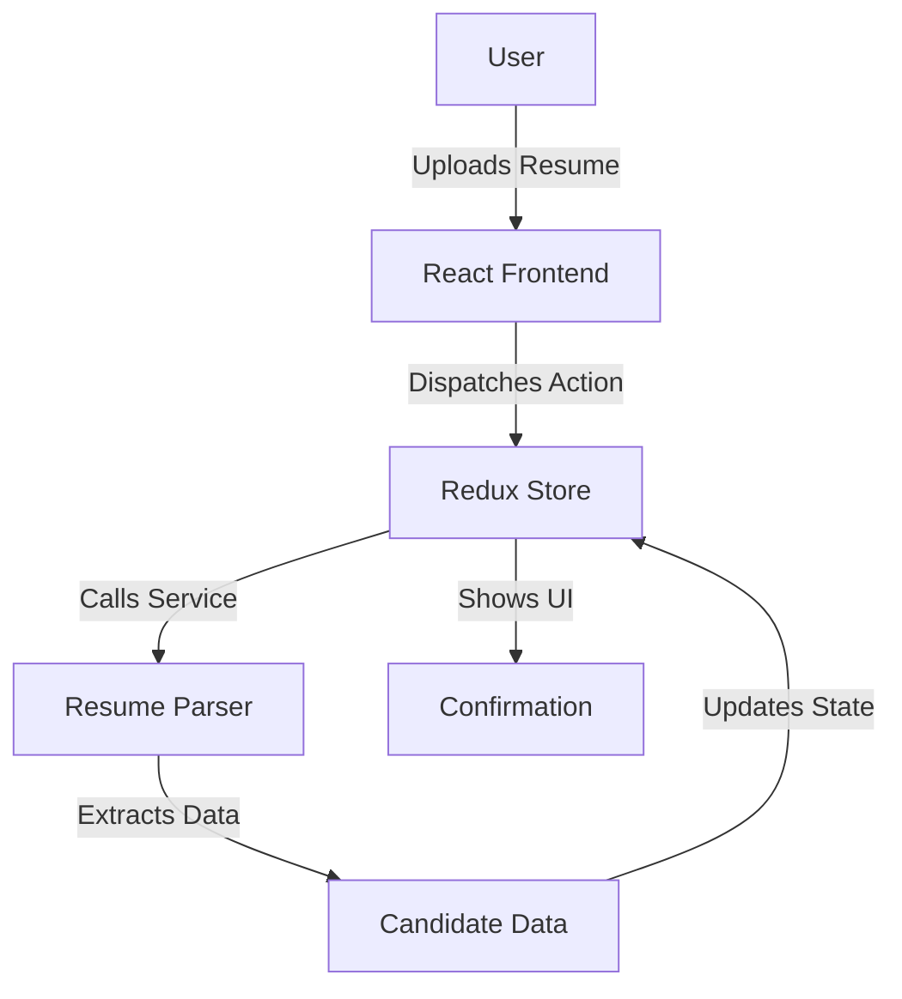
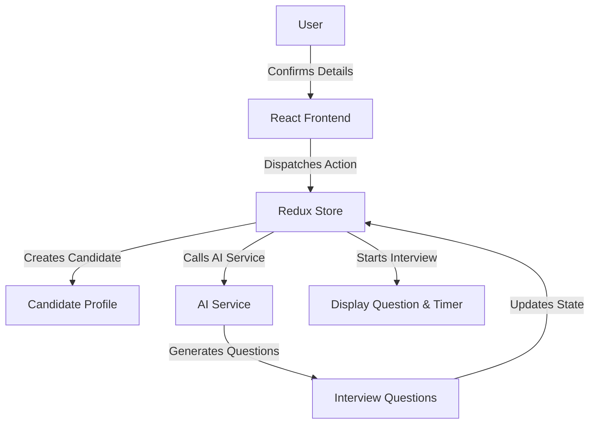
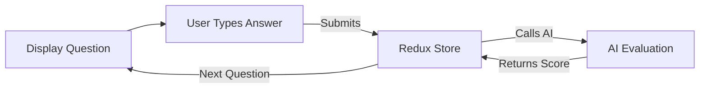
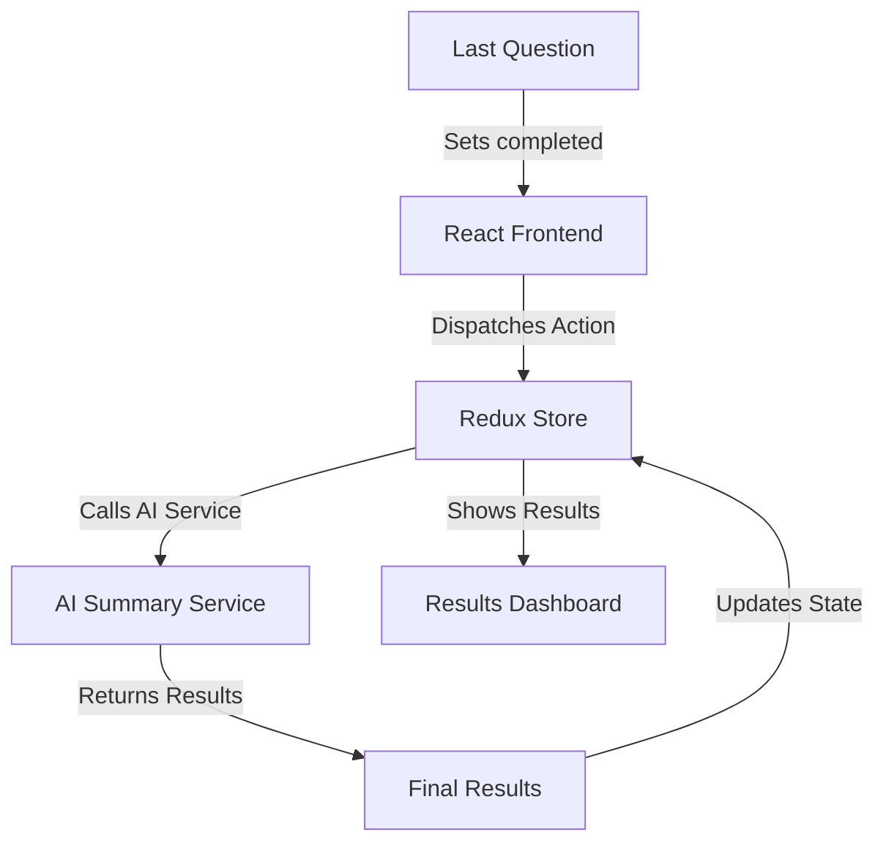

# System Architecture & Design Patterns

This document provides a detailed breakdown of the architectural patterns, design principles, and visual diagrams that form the foundation of the Crisp AI Interview Assistant.

## 1. Architectural Patterns

### 1.1. Flux Architecture (via Redux)

The application implements the unidirectional data flow of the Flux pattern using Redux Toolkit. This ensures a predictable and manageable state.

**Flow Diagram:**

```
┌─────────────┐    ┌───────────┐    ┌───────────┐    ┌──────────┐
│ User Action │───▶│ Dispatch  │───▶│ Reducers  │───▶│  Store   │
└─────────────┘    └───────────┘    └───────────┘    └──────────┘
     ▲                                              │
     └──────────────────────────────────────────────┘
              Re-render Components
```

**Data Flow:**
1. **User Action**: User interacts with the UI
2. **Dispatch**: Action is dispatched to the store
3. **Reducers**: Pure functions update state based on action
4. **Store**: Updated state triggers re-renders
5. **Components**: Subscribe to state changes and update UI

### 1.2. Layered Architecture

A clear separation of concerns is achieved through a layered architecture, isolating UI, state, logic, and external services.

**Layers Diagram:**

```
┌─────────────────────────────────────────┐
│           Presentation Layer            │
│              (Components)               │
├─────────────────────────────────────────┤
│         State Management Layer          │
│               (Redux Store)             │
├─────────────────────────────────────────┤
│          Business Logic Layer           │
│            (Services/Utils)             │
├─────────────────────────────────────────┤
│         External Services Layer         │
│           (APIs, AI Services)           │
└─────────────────────────────────────────┘
```

**Layer Responsibilities:**
- **Presentation Layer**: React components, UI rendering
- **State Management Layer**: Redux store, state updates
- **Business Logic Layer**: Application logic, data processing
- **External Services Layer**: API calls, third-party integrations

## 2. Design Patterns Used

### 2.1. Observer Pattern

Implemented via Redux subscriptions (`useSelector`), allowing components to "observe" and automatically re-render when the state they depend on changes.

### 2.2. Command Pattern

Redux actions (`dispatch(action)`) encapsulate requests as command objects, decoupling the component that initiates an action from the logic that processes it.

### 2.3. Strategy Pattern

The application is designed to easily swap different AI service strategies (e.g., a real Google AI service vs. a mocked service for testing) without altering the core application logic.

### 2.4. State Machine Pattern

The interview process follows a defined and predictable sequence of states, ensuring robust control over the session flow.

**Interview State Machine:**

```
IDLE → PARSING → AWAITING_CONFIRM → IN_PROGRESS → COMPLETED
                │
                └→ ERROR
```

**State Transitions:**
- **IDLE**: Initial state, ready to start
- **PARSING**: Processing job description
- **AWAITING_CONFIRM**: Waiting for user confirmation
- **IN_PROGRESS**: Interview session active
- **COMPLETED**: Interview finished successfully
- **ERROR**: Error state from any previous state

### 2.5. Factory Pattern

Redux Toolkit's `createAsyncThunk` acts as a factory for creating complex asynchronous operations (like starting an interview session), abstracting away the boilerplate of handling promise lifecycle actions.

# How the code works(Appliation Flow)

This document outlines the complete, four-phase application flow for the AI-powered interview platform, from the initial resume upload to the final results summarization. Each phase is designed to be a seamless step in the automated screening process.

---

## Phase 1: Resume Upload & Parsing

This initial phase handles the candidate's entry into the system. The user begins by uploading their resume, which is then automatically parsed to extract key contact information, setting the stage for the interview.

The process is as follows: A user uploads a **PDF** or **DOCX** file. This action triggers a Redux thunk, which calls a dedicated resume parsing service. This service uses **regular expressions (regex)** to identify and extract the candidate's name, email address, and phone number. Once the data is extracted, the application's state is updated, and a confirmation modal appears, presenting the parsed information to the user for verification.



---

## Phase 2: Interview Initialization

Once the candidate's details are confirmed, this phase creates the formal interview session. It generates a unique identity for the candidate and fetches a tailored set of questions from the AI service to begin the assessment.

The flow begins when the user clicks "confirm" in the modal. A new candidate object is created in the system, complete with a **unique identifier (UUID)**. A Redux thunk is then dispatched to initiate the interview session. This involves an asynchronous call to a **Google AI service**, which generates a structured set of interview questions: **two easy, two medium, and two hard**. Finally, the application state is updated with these questions, and the timer for the first question is initialized, officially starting the interview.



---

## Phase 3: The Interview Loop

This is the core interactive phase of the application where the candidate answers questions under timed conditions. The system cycles through each question, capturing the candidate's response, evaluating it in real-time, and progressing to the next challenge.

For each question, a **countdown timer** is displayed. The candidate types their answer into a **Tiptap rich-text editor**. When the user submits their answer or the timer expires, the response is sent to the AI evaluation service along with the original question. The AI analyzes the answer and returns a **score** and constructive **feedback**. This evaluation data is stored, the system moves to the next question, and the timer is reset accordingly. This loop continues until all questions have been answered.



---

## Phase 4: Completion & Summarization

The final phase concludes the interview process. After the last question is answered, the system aggregates all the data, generates a final score and a comprehensive performance summary, and updates the recruiter's dashboard.

This phase is triggered automatically when the `currentQuestionIndex` indicates that the last question has been completed. The interview `status` is set to **'completed'**, which in turn triggers a final Redux thunk. This thunk calls an AI service to process all the collected answers, scores, and feedback. The AI generates a holistic **AI summary** of the candidate's performance and calculates a **final average score**. This summary and score are then used to update the candidate's record, and the results are displayed in a summary card on the dashboard for the recruiter to review.




